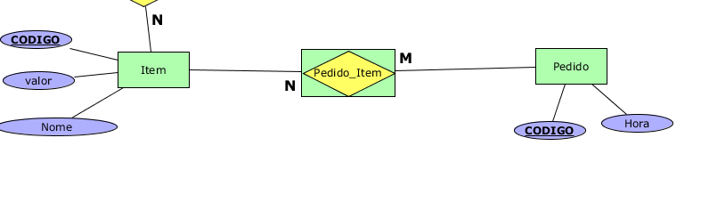

# Melhoria 1
A primeira melhoria seria adicionar uma generalização entre Cliente/Motorista/Estabelecimento para que não haja repetição de informação. Criar uma nova tabela que teria nome/endereço e adicionar na tabela Cliente/Motorista/Estabelecimento uma foreign key que corresponderia às informações na tabela de Entidade(generalização). Para fazer a generalização é necessário uma relação de (1,1); já que Cliente/Motorista/Estabelecimento não existe sem um endereço e nome.

Ainda é possível adicionar generalizações para pessoa física e jurídica, adicionando uma nova tabela que teria Cpf(Pessoa Física) e uma outra tabela com CNPJ(Pessoa Física) relacionando com a entidade (nome, endereço). Assim, a tabela Cliente/Motorista/Estabelecimento teria um id e uma relação com a tabela Entidade.

# Melhoria 2
A segunda melhoria corresponderia em mudar a relação "incluso" entre Pedido e Item e adicionar uma entidade-relacionamento entre elas, como proposto na imagem .
