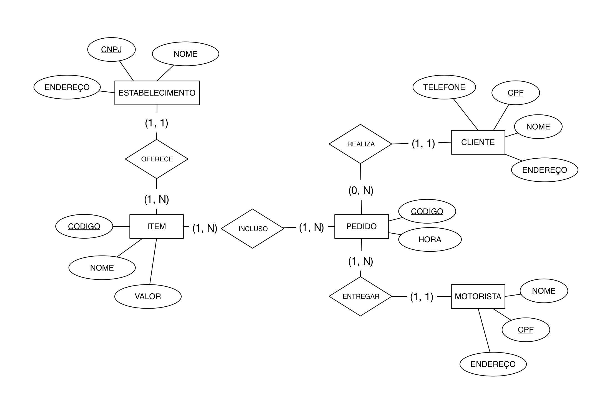

# Avaliação Banco de Dados

Desenvolvimento de Aplicações Web -- 2018

Professor: João Eduardo Montandon

Valor: 07 pontos

## MyFood

O MyFood é um serviço de entrega a domícilio de alimentos. Através de um aplicativo, o usuário poderá fazer o pedido de itens disponibilizados por meio de uma série de estabelecimentos já cadastrados na plataforma. A ideia do aplicativo está em fase de planejamento, e o CEO da empresa contratou os seus serviços para a modelagem e estruturação dos dados que serão armazenados.

Até o momento, a empresa possui apenas o Diagrama Entidade Relacionamento (DER), o qual pode ser visualizado abaixo:

Sua missão, [caso queira aceitar](https://media.giphy.com/media/gVhplI9SzXgoo/giphy.gif), consistirá nas seguintes tarefas:

1. **Diagrama Relacional:** Você deverá criar o diagrama relacional referente ao DER proposto.
1. **Scripts SQL:** Você deverá implementar um script SQL que conterá os comandos para criação das tabelas e suas restrições.
1. **Propor uma melhoria:** O DER original não está otimizado, (Estabelecimento, Motorista e Cliente compartilham o mesmo tipo de informação). Você deverá propor uma melhoria no DER original. Essa melhoria deverá ser descrita no formato de um novo diagrama.
