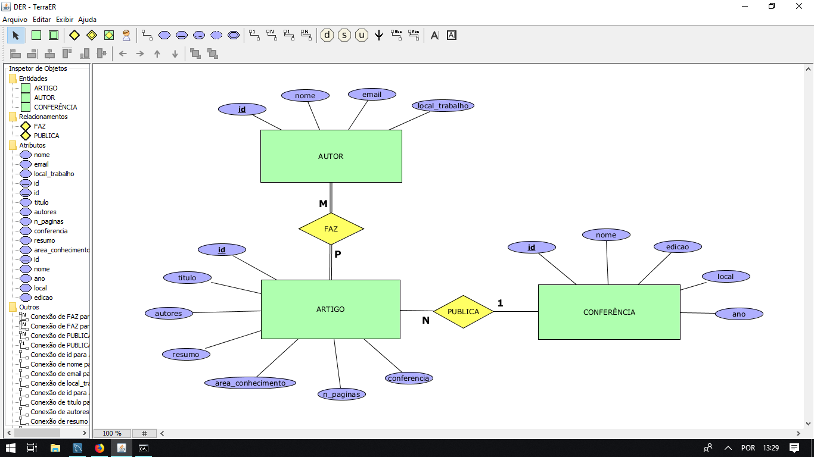

# Avaliação Banco de Dados

Desenvolvimento de Aplicações Web -- 2017

Professor: João Eduardo Montandon

Valor: 08 Pontos

## Copiadora Copyleft

A Copiadora Copyleft é uma empresa que atua no ramo de impressão de documentos. O gerente da empresa gostaria de informatizar a cadeia de produção da empresa e decidiu contratar os serviços da sua equipe. Após primeira reunião, sua equipe de projeto fez o levantamento do modelo conceitual dos dados, o qual pode ser visualizado abaixo:

### Modelo Relacional (05 pontos)

Implemente o Diagrama Relacional (DR) com base no modelo relacional descrito anteriormente.

Você deverá entregar:

* Uma screenshot do DR gerado
* Arquivo `.sql` com o código necessário para criar o banco de dados.

*Dica: utilize o software [MySQL Workbench](https://www.mysql.com/products/workbench/) para criação do diagrama DR.*

### Consultas SQL (03 pontos)

Com base no modelo gerado anteriormente, você deverá implementar as seguintes consultas em SQL.

1. Listar nome e marca de todas as impressoras existentes
1. Listar o nome, cargo, e salário de cada funcionário
1. Listar os detalhes de todos os atendimentos existentes
1. Listar os atendimentos que foram feitos nas impressoras de marca 'HP' 
1. Listar o nome dos clientes que foram atendidos até Julho de 2017
